# test collab.
- fork, pull request, merge, branch 작업은 github권장사항이나 지양
- 소규모작업이며 github에 익숙하지 않은 멤버들간 협업방안
- 이를 위해선 작업 원격저장소에 협업멤버 지정이 필요함
## collab. member workflow
1. 시작전에 원격수정사항을 pull
    - 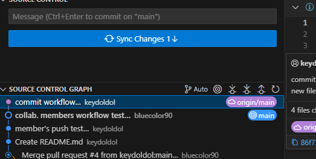
    - 로컬 수정사항인 <브랜치이름> 의 반영단계가 origin/<브랜치이름>
    - 원격수정사항이 로컬에 반영되어있지않은상태, pull로 반영후 작업
    - fetch로 미리 수정사항 확인가능, vscode는 자동으로 fetch해주는듯함
1. 로컬에 수정사항 발생시 changes에 수정사항 발생
    - 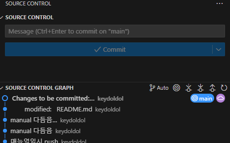
    - 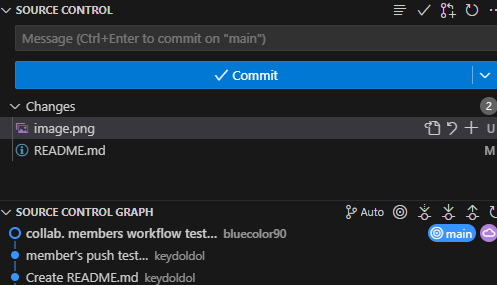
1. 수정사항을 stage, 저장소로 어떠한정보도 업로드되지않은상태
    - 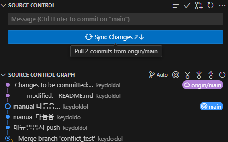
    - stage한 이후의 수정사항은 추가로 stage하지않는이상 commit에 포함되지않음
1. commit : stage단계의 수정사항들을 push 준비
    - (주의) 수정사항이 업로드되진않음
    - 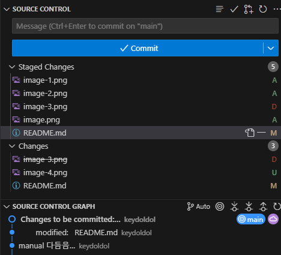
    - 로컬 장소인 main 만 리비전그래프가 갱신됨
    - push하기 전까지는 로컬 저장소인 main에만 반영되어있는모습
1. push : 원격저장소로 push
    - 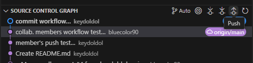
    - commit된 수정사항들만 저장소에 반영됨
    - vscode에서 stage ~ push를 동시에 진행할 수는 있음
## 필수 workflow
- 작업시작전, push직전 원격수정사항을 pull 하여 검토 필수
    - 단일 branch로 작업하므로 충돌 발생시 되돌리는 과정이 어려워질 수 있음
    - refork혹은 branch로 작업시 여러명의 작업결과물을 구분하여 볼 수 있음
    - conflict 발생예시 및 시도방법
        1. 원격수정사항을 fetch하지않고 수정작업진행 (권장x) 
            - 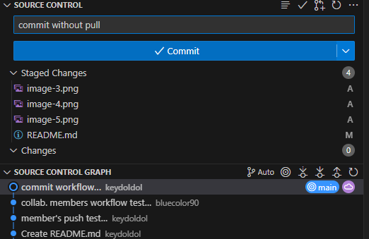
            - commit 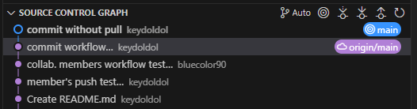
        1. 다른멤버가 그사이 commit한 곳과 비슷한부분을 수정함
            - 다른멤버 source control graph
            - 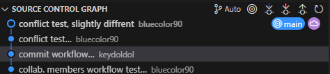
            - vscode는 주기적으로 origin쪽을 fetch해와서 해당부분을 source control graph에서 확인가능함(아래)
            - 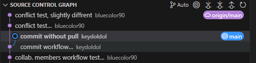
        1. 해당상황에서 원격수정사항과 비슷한부분 push 진행할시 pull 경고발생하여 push불가
            - 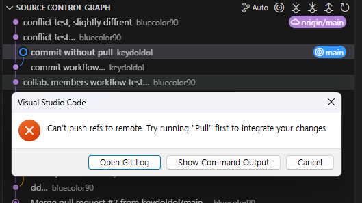
        1. pull 진행시 수정사항과 동일한 라인의 수정사항은 conflict 발생하여 오류발생
            - 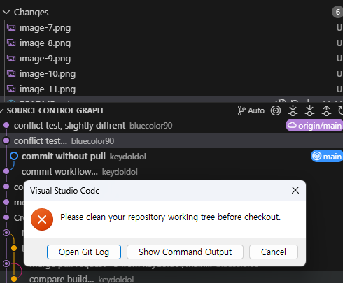
    - pull conflict 해결1. commit된 내용이 있을경우
        1. branch를 만들어 회피
            - 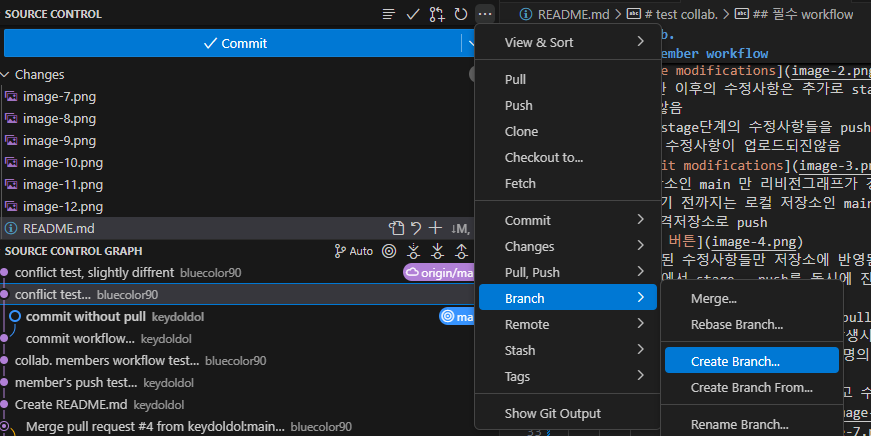
            - 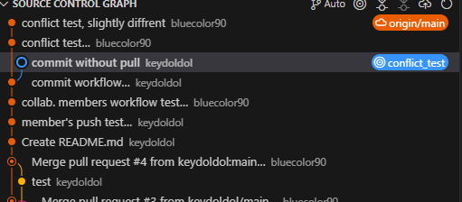
        2. main브랜치로 복귀 (cherry pick) 
            - 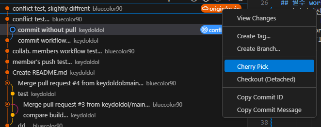

