# 소규모 협업방안 스터디
- fork, pull request, merge, branch 작업은 github권장사항이나 지양
- 소규모작업이며 github에 익숙하지 않은 멤버들간 협업방안
- 수정사항이 동시에 일어나지 않을때 사용가능함
- 이를 위해선 작업 원격깃헙저장소에 협업멤버 지정이 필요함(push권한 득)

## 확인해볼 일
- [ ] wiki로 게시하는법, 이슈관리
- [ ] 브랜치 생성후 checkout to 시 이동되는 범위 (unstaged, staged, commit)
- [ ] tag, release 확인
- [ ] 로컬 commit하지 않은상태에서 원격 수정사항 발생시 stash 이용가능한지 확인해보기

## vscode source control graph 상태확인방법
- 아이콘으로 현 깃헙업로드상태 확인가능

- origin : 지정가능하나, 통상 clone해온 원격깃헙저장소(깃헙)를 지칭
- main : 로컬 저장소의 `main` 브랜치
- origin/main : 원격깃헙저장소의 `main` 브랜치의 현 상태
- origin/HEAD : 원격깃헙저장소의 가장 최신 수정내역을 나타내는 아이콘

## push까지의 단계
- staged changes -> commit -> push, push까지되어야 깃헙에 반영됨
- unstaged : 로컬에 파일 저장만되어있는단계
- staged changes:  commit 준비, commit전 수정사항을 단계별로 검토가능
- commit : 로컬 저장소로 수정사항 업로드, 깃헙에는 게시되지 않은상태임
    - 단, 로컬 저장소도 혼자 소스코드를 관리하는 구역임
    - 그러므로 이부분에서 이전 상태로 돌아가거나 브랜치로 코드를 분기하는 등의 기능을 할 수 있음
    - 로컬에 commit된걸 되돌리는 것도 절차가 있으므로 주의
- push : 깃헙으로 게시
    - 혼자 작업할 경우 commit과 push가 비슷한 기능을 한다고 보면되나
    - 단, commit만으로는 깃헙에 반영되지 않음

## 필수 workflow
- 작업시작전, push직전 원격수정사항을 pull 하여 검토 필수 

    - 단일 branch로 작업하므로 충돌 발생시 되돌리는 과정이 어려워질 수 있음 (이경우 conflict 발생사례 확인)
    - refork혹은 branch로 작업시 여러명의 작업결과물을 구분하여 볼 수 있음
- stage & commit & push : 권장하지않으나 원격깃헙저장소에 수정사항이 전혀없는 혼자 작업한다면 상태라면, 동시에 진행해도될듯함 

- commit messege 없이 업로드할수는 없음, 공란으로 commit 진행시 vscode에서는 아래와같이 수정내역 올리는 임시파일 보여줌 

    - `#` 으로시작되는 줄은 무시됨
    - modification 내역 파일들은 주석제거해서 업로드하는게 좋은편(이력관리), 안해도 모든 staged된 파일들 commit됨
## 단일브랜치, 소규모 협업방법 상세
1. 시작전에 원격수정사항을 pull 
    - 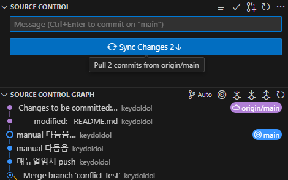
    - 원격수정사항(예시의 `origin/main`)이 로컬(에시의 `@main`)에 반영되어있지않은상태, pull로 반영후 작업
    - fetch로 미리 수정사항 확인가능, vscode는 자동으로 fetch해주는듯함
1. unstaged, 로컬에 수정사항 발생시 changes에 수정사항 발생 
    - 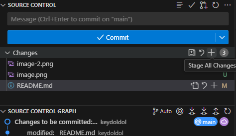
1. staged changes, 수정사항을 stage,
    - 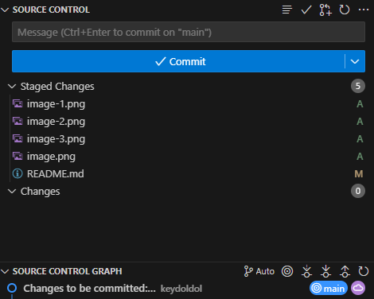
    - 로컬/원격 저장소로 어떠한정보도 업로드되지않은상태
    - stage한 이후의 수정사항은 추가로 stage하지않는이상 commit에 포함되지않음
    - 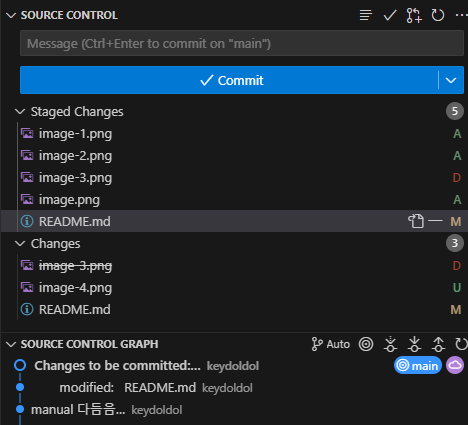
1. commit : stage단계의 수정사항들을 push 준비
    - 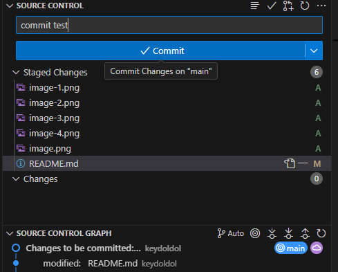
    - (주의) 수정사항이 저장소로 업로드되진 않은상태, 로컬 소스관리에서 확정한상태라고 보면됨 
        - 로컬 장소인 main 만 리비전그래프가 갱신됨
    - 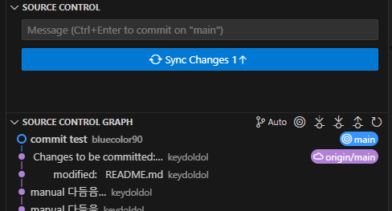
        - push하기 전까지는 로컬 저장소 (`@main`)에만 반영되어있는모습
        - 로컬(`@main`)의 상태가 원격깃헙저장소(`origin/main`) 보다 앞서는 모습
1. push : 원격깃헙저장소로 push (vscode `sync changes` 시 자동 push pull)
    - commit된 수정사항들만 저장소에 반영됨
    - vscode에서 stage ~ push를 동시에 진행할 수는 있음
    - 이때 원격의 수정사항 있다면 push 안될수 있음 (conflict 참조)
    - 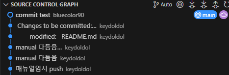
    - push 이후 원격깃헙저장소(`origin/main`)의 상태가 로컬(`@main`)상태와 일치함

## conflict 발생예시 및 시도방법
- conflict : 수정사항이 같은곳에서 동시에 발생함, 조치필요
### 발생예시 (따라하지 말것)
1. origin원격수정사항을 pull하지않고 수정작업진행 (권장x) 
    - commit 

1. 다른멤버가 그사이 commit한 곳과 비슷한부분을 수정함
    - vscode는 주기적으로 origin쪽을 fetch해와서 해당부분을 source control graph에서 확인가능함(아래) 

1. 충돌 상황과 관계없이 현상태에서 pull시 경고발생하여 로컬commit 사항 push불가 

1. pull도 진행안됨, 수정사항과 동일한 라인의 수정사항은 conflict 발생하여 오류발생 

### 방법1. 로컬 수정사항 commit한것이 없는경우
- stash이용

### 방법2. pull conflict 해결 commit된 내용이 있을경우
- `main` branch에서 conflict 발생했고, commit되어있는경우
1. branch를 만들어 회피, push되지않은 commit과, unstaged 수정사항 모두 해당브랜치로 이동함 (`conflict_test` 브랜치로 생성) 

    - 로컬 브랜치 이름이 지정한 `conflict_test` 로 변경되었고, source control graph에서도 변경사항 볼 수 있음, `git branch`로도 확인가능 

1. unstage되어있던것도 모두 commit, 브랜치가 `conflict_test`로 바뀌었고, 해당내역들을 추후 merge해야함 (만들어놓은 `conflict_test` branch로 commit됨)

1. publich branch (필요한지모르겠음)
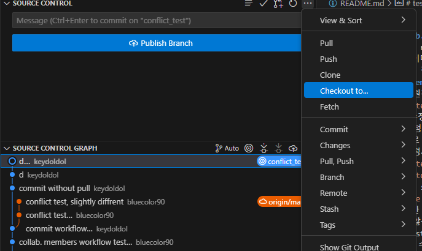

1. 돌아와서 conflict발생한 로컬수정사항 모두 원복 undo commit 
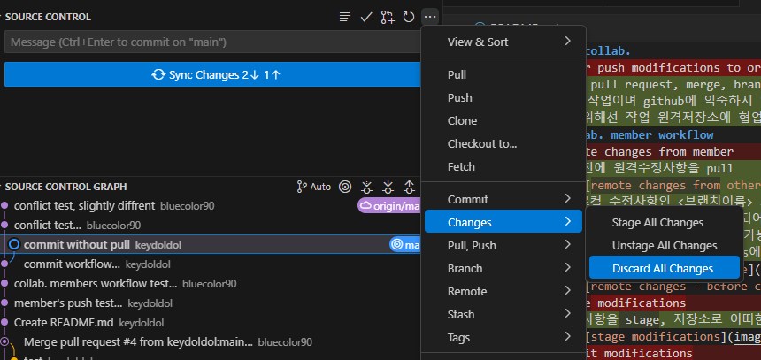

    - unstage all changes 
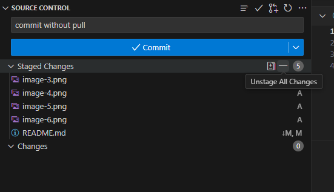

1. `conflict_test`로 이동된 commit내역 undo 
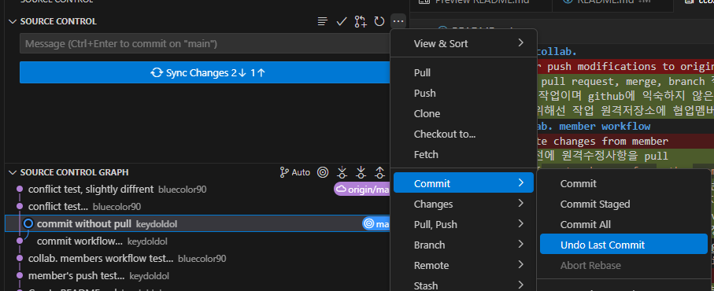

1. discard all changes 
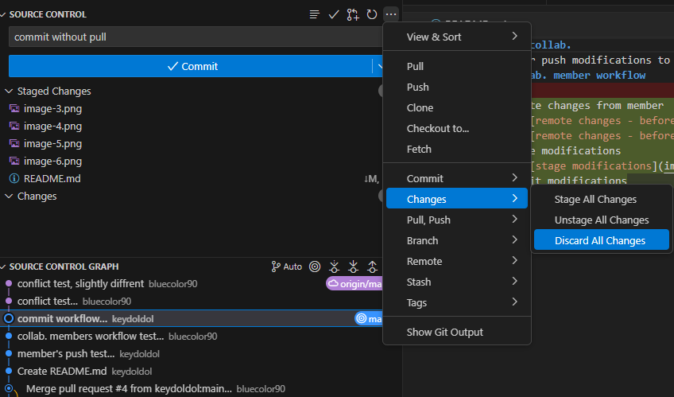

1. conflict발생했던 원본의 수정사항 pull 
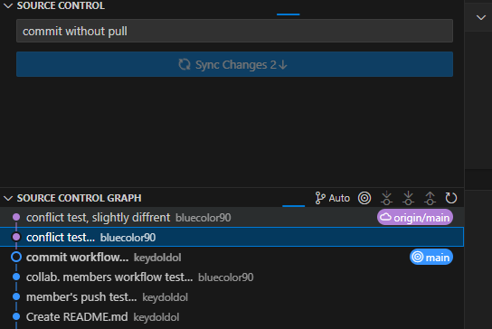

1. main브랜치에서 conflict_test 브랜치 merge 
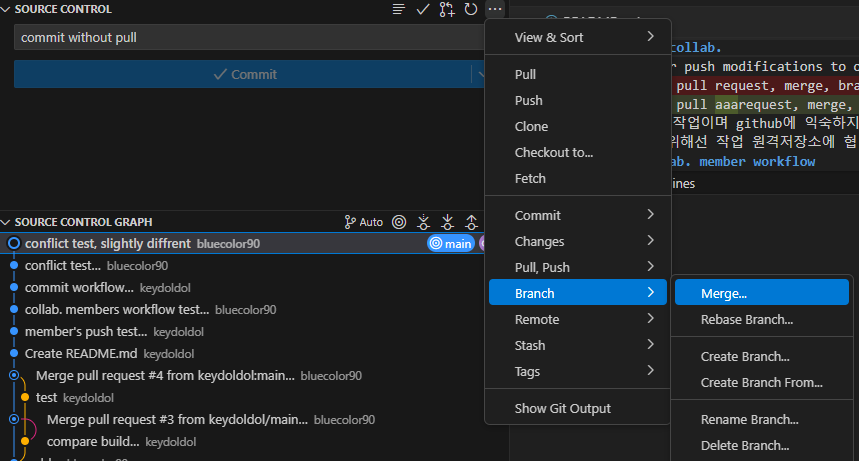
 
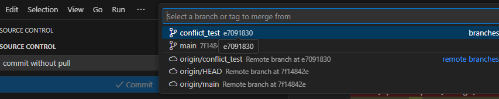

1. 충돌파일들 resolve 위해 수정, 
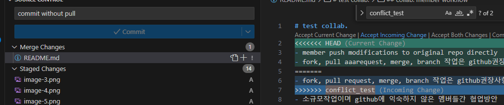

1. 수정후 resolve (에디터상 resolve file 혹은 stage file)
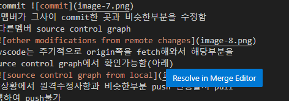

1. commit & push 
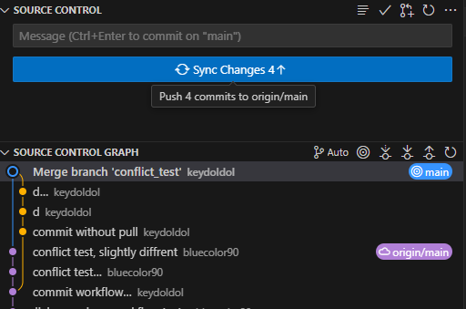
