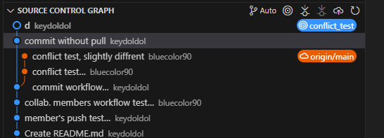

# test collab.
- fork, pull request, merge, branch 작업은 github권장사항이나 지양
- 소규모작업이며 github에 익숙하지 않은 멤버들간 협업방안
- 이를 위해선 작업 원격저장소에 협업멤버 지정이 필요함
## collab. member workflow
1. 시작전에 원격수정사항을 pull
    - 

    - 로컬 수정사항인 <브랜치이름> 의 반영단계가 origin/<브랜치이름>
    - 원격수정사항이 로컬에 반영되어있지않은상태, pull로 반영후 작업
    - fetch로 미리 수정사항 확인가능, vscode는 자동으로 fetch해주는듯함
1. 로컬에 수정사항 발생시 changes에 수정사항 발생
    - 

    - 

1. 수정사항을 stage, 저장소로 어떠한정보도 업로드되지않은상태
    - 

    - stage한 이후의 수정사항은 추가로 stage하지않는이상 commit에 포함되지않음
1. commit : stage단계의 수정사항들을 push 준비
    - (주의) 수정사항이 업로드되진않음
    - 

    - 로컬 장소인 main 만 리비전그래프가 갱신됨
    - push하기 전까지는 로컬 저장소인 main에만 반영되어있는모습
1. push : 원격저장소로 push
    - 

    - commit된 수정사항들만 저장소에 반영됨
    - vscode에서 stage ~ push를 동시에 진행할 수는 있음
## 필수 workflow
- 작업시작전, push직전 원격수정사항을 pull 하여 검토 필수
    - 단일 branch로 작업하므로 충돌 발생시 되돌리는 과정이 어려워질 수 있음
    - refork혹은 branch로 작업시 여러명의 작업결과물을 구분하여 볼 수 있음
## conflict 발생예시 및 시도방법
1. 원격수정사항을 fetch하지않고 수정작업진행 (권장x) 
    - 

    - commit 

1. 다른멤버가 그사이 commit한 곳과 비슷한부분을 수정함
    - 다른멤버 source control graph
    - 

    - vscode는 주기적으로 origin쪽을 fetch해와서 해당부분을 source control graph에서 확인가능함(아래)
    - 

1. 해당상황에서 원격수정사항과 비슷한부분 push 진행할시 pull 경고발생하여 push불가 

1. pull 진행시 수정사항과 동일한 라인의 수정사항은 conflict 발생하여 오류발생 

### pull conflict 해결1. commit된 내용이 있을경우
- `main` branch에서 conflict 발생했고, commit되어있는경우
1. branch를 만들어 회피, push되지않은 commit과, unstaged 수정사항 모두 해당브랜치로 이동함 (`conflict_test` 브랜치로 생성) 

1. unstage되어있던것도 모두 commit, 브랜치가 `conflict_test`로 바뀌었고, 해당내역들을 추후 merge해야함 (만들어놓은 `conflict_test` branch로 commit됨)

1. publich branch (필요한지모르겠음)

1. 돌아와서 conflict발생한 로컬수정사항 모두 원복 undo commit 

    - unstage all changes 

1. `conflict_test`로 이동된 commit내역 undo 

1. discard all changes 

1. conflict발생했던 원본의 수정사항 pull 

1. main브랜치에서 conflict_test 브랜치 merge 

 

1. 충돌파일들 resolve 위해 수정, 

1. 수정후 resolve (에디터상 resolve file 혹은 stage file)

1. commit & push 

